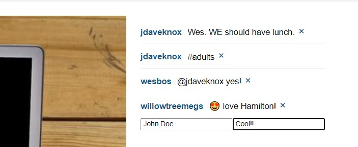

## Proyecto Reduxstagram

Publicaciones con foto estilo Instagram

#### Tecnología usada:
```
React + Redux + webpack
```
#### Instalar dependencias:
```
yarn install
```

#### Arranque
Ejecuta `yarn start` y abre <localhost:7770> en el navegador
#### Capturas
- Viualizando el listado de publicaciones

#####


- Viualizando una publicación
#####


- Agregando comentario
#####


- Comentario agregado
#####


- Dar like y visualizar número de comentarios
#####


- Vuelta al listado de publicaciones con la información actualizada
#####
